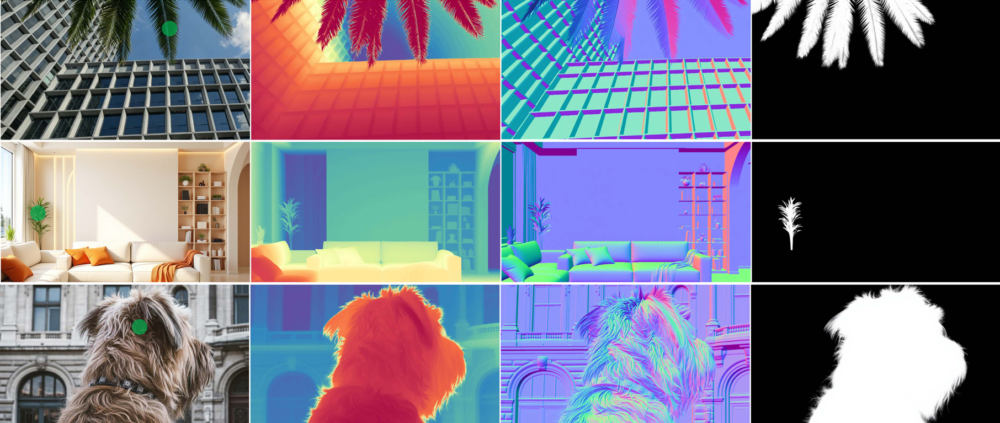

<!-- 
# Edit2Perceive: Image Editing Diffusion Models Are Strong Dense Perceivers
*Yiqing Shi, Yiren Song, Mike Zheng Shou*


[](https://arxiv.org/abs/2511.18673)
[](https://hf-mirror.com/Seq2Tri/Edit2Perceive/tree/main)



## Installation

1. **Clone the repository**

    ```bash
    git clone https://github.com/showlab/Edit2Perceive.git
    cd Edit2Perceive
    conda create -n e2p python=3.12 # recommend version
    conda activate e2p
    pip install -r requirements.txt
    ```

2. **Download Base Model**

    Download the [FLUX.1-Kontext-dev](https://huggingface.co/black-forest-labs/FLUX.1-Kontext-dev) model:
    ```bash
    export HF_ENDPOINT=https://hf-mirror.com # if huggingface is not available, use this mirror
    hf download black-forest-labs/FLUX.1-Kontext-dev --exclude "transformer/" --local-dir ./FLUX.1-Kontext-dev
    ```
3. **Download Our Models**

    Download our pre-trained models and place them in the `ckpts/` directory. You can either download lora version (small size for fast validation) or full version (best quality but file is large):
    
    **Option1** Download LoRA weights
    ```bash
    hf download Seq2Tri/Edit2Perceive --local-dir ckpts/ --include "*lora.safetensors"
    hf download Seq2Tri/Edit2Perceive --local-dir ckpts/ --exclude "*lora.safetensors"
    ```
    **Option2** Download full model weights
    ```bash
    ```
    The Final Folder Sturcture should be like this:
    ```bash
    ckpts/
    ├── depth.safetensors
    ├── depth_lora.safetensors
    ├── normal.safetensors
    ├── normal_lora.safetensors
    ├── matting.safetensors
    └── matting_lora.safetensors
    ```

## Inference
### UI

```bash
python app.py
```
and then visit `http://localhost:7860`

### No UI

```bash
python inference.py
```
## Eval on benchmarks
Please download the evluation datasets: [depth](https://share.phys.ethz.ch/~pf/bingkedata/marigold/evaluation_dataset),[normal](https://share.phys.ethz.ch/~pf/bingkedata/marigold/marigold_normals/evaluation_dataset), matting:[P3M-10k](https://github.com/JizhiziLi/P3M),[AM-2k](https://github.com/JizhiziLi/GFM) and [AIM-500](https://github.com/JizhiziLi/AIM)

And then run:
```bash
python utils/eval_multiple_datasets.py --task depth --state_dict ckpts/depth.safetensors
python utils/eval_multiple_datasets.py --task normal --state_dict ckpts/normal.safetensors
python utils/eval_multiple_datasets.py --task matting --state_dict ckpts/matting.safetensors

```
## Train
### Prepare training dataset
#### Depth

Prepare for Hypersim and Virtual KITTI 2 datasets.

1. Hypersim Dataset
    ```bash
    python preprocess/depth/download_hypersim.py --contains color.hdf5 depth_meters.hdf5 position.hdf5 render_entity_id.hdf5 normal_cam.hdf5 normal_world.hdf5 --silent
    ```
    After download, preprocess with 
    ```
    python preprocess/depth/preprocess_hypersim.py --dataset_dir /path/to/hypersim --output_dir /path/to/output
    ```

2. Virtual KITTI 2 Dataset: Download by this [link](https://europe.naverlabs.com/proxy-virtual-worlds-vkitti-2/)

#### Normals
Prepare for Hypersim, Interiorverse and Sintel datasets.
1. Hypersim Dataset

    Download by this command:
    ```bash
    python preprocess/depth/download_hypersim.py --contains color.hdf5 position.hdf5 normal_cam.hdf5 normal_world.hdf5 render_entity_id.hdf5 --silent
    ``` 
    Preprocess with:
    ```bash
    python preprocess/normal/preprocess_hypersim_normals.py --dataset_dir /path/to/hypersim --output_dir /path/to/output
    ```
2. InteriorVerse Dataset: Refer to [download instructions](https://interiorverse.github.io/#download) and preprocess with `python preprocess/normal/preprocess_interiorverse_normals.py --dataset_dir /path/to/interiorverse --output_dir /path/to/output`
3. Sintel Dataset: Download by this [link](http://files.is.tue.mpg.de/sintel/MPI-Sintel-complete.zip) or [alternative link](http://sintel.cs.washington.edu/MPI-Sintel-complete.zip)

#### Matting
[Composition-1k](https://github.com/JizhiziLi/GFM), [Distinctions-646](https://github.com/yuhaoliu7456/CVPR2020-HAttMatting), [AM-2k](https://github.com/JizhiziLi/GFM), [COCO-Matting](https://github.com/XiaRho/SEMat?tab=readme-ov-file)

For Distinctions-646 Dataset, the official repo offers the fg and alpha without bg and merged, bg is sampled from  [VOC2012](https://datasets.cms.waikato.ac.nz/ufdl/data/pascalvoc2012/VOCtrainval_11-May-2012.tar) and you need to gen merged dataset yourself (refer to `preprocess/matting/preprocess_distinctions_646.py`).

For COCO-Matting Dataset, you need to download [COCO-Matting_trimap_alpha.7z
](https://drive.google.com/file/d/1Q-clw6T6OnNNDEJ0gtkqOEIagVAvqFWU/view?usp=sharing)and [train2017.zip](http://images.cocodataset.org/zips/train2017.zip) , and then split the trimap_alpha (concat in width) file into single alpha.

After the dataset preparation, change the `--dataset_base_path` to your dataset absolute path in scripts/*.sh, for example(the dataset order is important, please don't change):
```bash
# depth task: Hypersim + VKITTI2
--dataset_base_path "/mnt/nfs/workspace/syq/dataset/Hypersim/processed_depth,/mnt/nfs/workspace/syq/dataset/vkitti2"
# normal task: Hypersim + InteriorVerse + Sintel
--dataset_base_path "/mnt/nfs/workspace/syq/dataset/Hypersim/processed_normal,/mnt/nfs/workspace/syq/dataset/InteriorVerse/processed_normal,/mnt/nfs/workspace/syq/dataset/sintel" \
# matting task: 
--dataset_base_path /mnt/nfs/workspace/syq/dataset/matting/composition-1k,/mnt/nfs/workspace/syq/dataset/matting/Distinctions-646,/mnt/nfs/workspace/syq/dataset/matting/AM-2k,/mnt/nfs/workspace/syq/dataset/matting/COCO-Matte \
```
And then start to train:
```bash
bash scripts/Kontext_depth_lora.sh
bash scripts/Kontext_depth.sh
bash scripts/Kontext_normal_lora.sh
bash scripts/Kontext_normal.sh
bash scripts/Kontext_matting_lora.sh
bash scripts/Kontext_matting.
```

## Cite
If you find our work useful in your research please consider citing our paper:

```Bibtex
@misc{edit2perceive,
      title={Edit2Perceive: Image Editing Diffusion Models Are Strong Dense Perceivers}, 
      author={Yiqing Shi and Yiren Song and Mike Zheng Shou},
      year={2025},
      eprint={2511.18673},
      archivePrefix={arXiv},
      primaryClass={cs.CV},
      url={https://arxiv.org/abs/2511.18673}, 
}
```

## Contact
If you have any questions, please feel free to contact yqshi@stu.pku.edu.cn -->

# Edit2Perceive: Image Editing Diffusion Models Are Strong Dense Perceivers
**Yiqing Shi**, **Yiren Song**, **Mike Zheng Shou**


[](https://arxiv.org/abs/2511.18673)
[](https://hf-mirror.com/Seq2Tri/Edit2Perceive/tree/main)
[](https://github.com/showlab/Edit2Perceive/blob/main/LICENSE)


> **Abstract:** We present **Edit2Perceive**, a unified framework for diverse dense prediction tasks. We demonstrate that image editing diffusion models (specifically FLUX.1 Kontext), rather than text-to-image generators, provide a better inductive bias for deterministic dense perception. Our model achieves state-of-the-art performance across **Zero-shot Monocular Depth Estimation**, **Surface Normal Estimation**, and **Interactive Matting**, supporting efficient single-step deterministic inference.

---
## 📰 News
**Dec 19, 2025** Inference Code Release, with model weights

**Dec 23, 2025** Training Code Release
## 🛠️ Installation

### 1. Environment Setup

```bash
git clone [https://github.com/showlab/Edit2Perceive.git](https://github.com/showlab/Edit2Perceive.git)
cd Edit2Perceive

# Create environment (Python 3.12 recommended)
conda create -n e2p python=3.12 
conda activate e2p

# Install dependencies
pip install -r requirements.txt
```

### 2. Download Models

**Step 1: Download Base Model (FLUX.1-Kontext)**

```bash
# If huggingface is not available, use mirror
export HF_ENDPOINT=https://hf-mirror.com

hf download black-forest-labs/FLUX.1-Kontext-dev --exclude "transformer/" --local-dir ./FLUX.1-Kontext-dev
```

**Step 2: Download Edit2Perceive Weights**
Place the models in the `ckpts/` directory.

* **Option A: LoRA Weights** (Small size, fast validation)
```bash
hf download Seq2Tri/Edit2Perceive --local-dir ckpts/ --include "*lora.safetensors"
```


* **Option B: Full Model Weights** (Best quality)
```bash
hf download Seq2Tri/Edit2Perceive --local-dir ckpts/ --exclude "*lora.safetensors"
```


**Required Directory Structure:**

```text
Edit2Perceive/
├── ckpts/
│   ├── depth.safetensors
│   ├── depth_lora.safetensors
│   ├── normal.safetensors
│   ├── normal_lora.safetensors
│   ├── matting.safetensors
│   └── matting_lora.safetensors
├── FLUX.1-Kontext-dev/
└── ...
```

---

## 🚀 Inference

### Web UI (Gradio)

```bash
python app.py # Visit http://localhost:7860
```

### Command Line

Run inference on images without the UI:

```bash
python inference.py
```


## 📊 Evaluation

### 1. Prepare Datasets

Please download the evaluation datasets from the links below:

* **Depth:** [Evaluation Dataset](https://share.phys.ethz.ch/~pf/bingkedata/marigold/evaluation_dataset)
* **Normal:** [Evaluation Dataset](https://share.phys.ethz.ch/~pf/bingkedata/marigold/marigold_normals/evaluation_dataset)
* **Matting:** [P3M-10k](https://github.com/JizhiziLi/P3M), [AM-2k](https://github.com/JizhiziLi/GFM), [AIM-500](https://github.com/JizhiziLi/AIM)

### 2. Run Evaluation
Before run evaluation, chagne the `gt_path` in `utils/eval_multiple_datasets.py` to your dataset path. And then
```bash
# Depth
python utils/eval_multiple_datasets.py --task depth --state_dict ckpts/depth.safetensors

# Normal
python utils/eval_multiple_datasets.py --task normal --state_dict ckpts/normal.safetensors

# Matting
python utils/eval_multiple_datasets.py --task matting --state_dict ckpts/matting.safetensors
```

---

## 🏋️ Training

### 1. Dataset Preparation

Set up the datasets for your target task.

<details>
<summary><strong>Datasets for Depth Estimation</strong> (Hypersim & Virtual KITTI 2)</summary>

1. **Hypersim Dataset**
* Download:
```bash
python preprocess/depth/download_hypersim.py --contains color.hdf5 depth_meters.hdf5 position.hdf5 render_entity_id.hdf5 normal_cam.hdf5 normal_world.hdf5 --silent
```

* Preprocess:
```bash
python preprocess/depth/preprocess_hypersim.py --dataset_dir /path/to/hypersim --output_dir /path/to/output
```


2. **Virtual KITTI 2 Dataset**
* Download from [here](https://europe.naverlabs.com/proxy-virtual-worlds-vkitti-2/).


</details>

<details>
<summary><strong>Datasets for Surface Normal</strong> (Hypersim, InteriorVerse & Sintel)</summary>

1. **Hypersim Dataset**
* Download:
```bash
python preprocess/depth/download_hypersim.py --contains color.hdf5 position.hdf5 normal_cam.hdf5 normal_world.hdf5 render_entity_id.hdf5 --silent
```


* Preprocess:
```bash
python preprocess/normal/preprocess_hypersim_normals.py --dataset_dir /path/to/hypersim --output_dir /path/to/output
```


2. **InteriorVerse Dataset**
* Refer to [download instructions](https://interiorverse.github.io/#download).
* Preprocess:
```bash
python preprocess/normal/preprocess_interiorverse_normals.py --dataset_dir /path/to/interiorverse --output_dir /path/to/output
```


3. **Sintel Dataset**
* Download via [Link 1](http://files.is.tue.mpg.de/sintel/MPI-Sintel-complete.zip) or [Link 2](http://sintel.cs.washington.edu/MPI-Sintel-complete.zip).


</details>

<details>
<summary><strong>Datasets for Interactive Matting</strong> (Comp-1k, Distinctions, AM-2k, COCO)</summary>

* **Sources:** [Composition-1k](https://github.com/JizhiziLi/GFM), [Distinctions-646](https://github.com/yuhaoliu7456/CVPR2020-HAttMatting), [AM-2k](https://github.com/JizhiziLi/GFM), [COCO-Matting](https://github.com/XiaRho/SEMat?tab=readme-ov-file).
* **Special Instructions:**
* **Distinctions-646:** You must generate the merged dataset yourself using backgrounds sampled from [VOC2012](https://datasets.cms.waikato.ac.nz/ufdl/data/pascalvoc2012/VOCtrainval_11-May-2012.tar). Refer to `preprocess/matting/preprocess_distinctions_646.py`.
* **COCO-Matting:** Download [trimap_alpha](https://www.google.com/search?q=https://drive.google.com/file/d/1Q-clw6T6OnNNDEJ0gtkqOEIagVAvqFWU/view%3Fusp%3Dsharing) and [train2017.zip](http://images.cocodataset.org/zips/train2017.zip). Mannually split the `trimap_alpha` (concatenated in width) into single alpha channels.


</details>

### 2. Configure Paths

Update the `--dataset_base_path` in the scripts located in `scripts/*.sh`. **Note: The dataset order is strict and must not be changed.**

```bash
# Example for Depth (Hypersim + VKITTI2)
--dataset_base_path "/path/to/Hypersim/processed_depth,/path/to/vkitti2"

# Example for Normal (Hypersim + InteriorVerse + Sintel)
--dataset_base_path "/path/to/Hypersim/processed_normal,/path/to/InteriorVerse/processed_normal,/path/to/sintel"

# Example for Matting
--dataset_base_path "/path/to/composition-1k,/path/to/Distinctions-646,/path/to/AM-2k,/path/to/COCO-Matte"
```

### 3. Run Training

Execute the corresponding script for LoRA or Full Fine-tuning, more details of training refer to [training_args_instructions.md](./scripts/training_args_instructions.md)

```bash
# Depth Estimation
bash scripts/Kontext_depth_lora.sh
bash scripts/Kontext_depth.sh

# Surface Normal Estimation
bash scripts/Kontext_normal_lora.sh
bash scripts/Kontext_normal.sh

# Interactive Matting
bash scripts/Kontext_matting_lora.sh
bash scripts/Kontext_matting.
```

---

## 📝 Cite

If you find our work useful in your research, please consider citing our paper:

```bibtex
@misc{shi2025edit2perceive,
      title={Edit2Perceive: Image Editing Diffusion Models Are Strong Dense Perceivers}, 
      author={Yiqing Shi and Yiren Song and Mike Zheng Shou},
      year={2025},
      eprint={2511.18673},
      archivePrefix={arXiv},
      primaryClass={cs.CV},
      url={[https://arxiv.org/abs/2511.18673](https://arxiv.org/abs/2511.18673)}, 
}
```

## 📧 Contact

If you have any questions, please feel free to contact **Yiqing Shi** at [yqshi@stu.pku.edu.cn](mailto:yqshi@stu.pku.edu.cn).
